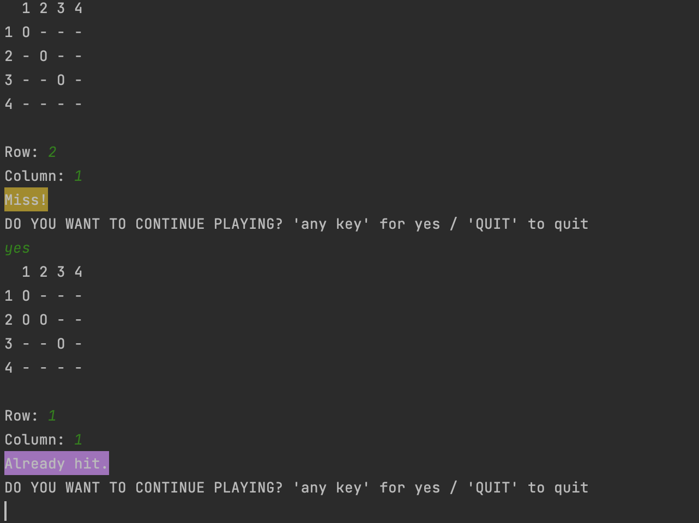

# BOAFinal Project

## Project Description 
This project's goal was to create a game that runs in the console. Our group chose to create a game inspired by Battle Ship. The way our game works is the computer randomly places ships on the board. Then it asks the user to input the "Row" and "Column" they'd like to hit. If they miss, an "O" will appear on that spot on the board. If they hit the ship an "X" will appear on that spot. Once all ships are hit, "You Win!" will appear in the console.  

## Languages 
Java

## How to Run
Open in your IDE. Run "Main.java" file. Play in console.

## How to Use 
This could be used as a game on a website or as a building block for a large game.

## Future Plans
Although our project guidelines specifically asked for an in-console game, we'd like to eventually create this game as a GUI. This will allow for a more aesthetic, enjoyable user interface. Also, we'd like to implement features to make the game more intricate, like power ups! 